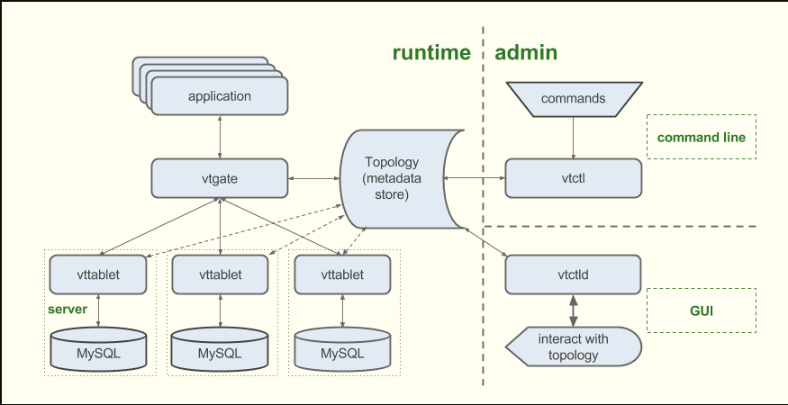

# 使用vitess 扩展mysql
## 入门
### 规划
推荐的一些最佳实践  
* 单元测试的覆盖率
* 考虑从副本读取
* 避免复杂的数据关系. 虽然RDBMS系统可以很好的处理他们,但这些关系会在未来妨碍扩展.到时候可以更好的切分数据
* 避免以存储过程, 外键, 触发器的形式把过多的逻辑放在数据库中, 这些操作会增加数据库的负担并阻碍数据库的扩展
## 第一步:配置数据库集群
首先,计划创建一个数据库集群, 有一个主实例, 多个副本(从). 主库不可用,从库可以进行接管,并且他们可以处理制度的流量.也可以进行定期备份.  
值得注意的是, 主库的 数据可靠性是个复杂而关键的挑战.任何时候分片只能有一个主库实例 略略
### 保持路由逻辑不在你的应用中  
vitess 有一些组件可以把复杂性排除在你的应用之外
* 每个mysql实例都有一个配对的 **vttablet** 进程, 提供一些 类似 连接池, 查询重写, 查询去重 的特性
* 你的应用会发送请求到 **vtgate** ,这个一个将流量路由到正确 vttable(s)的轻量代理, 然后将汇总结果反馈给应用
* Topology Service -- vitess 支持 zookeeper, etcd, consul -- 维护数据库系统的配置数据, vitess 依赖这个服务来知道如何根据路由规则,mysql实例的可用性,去路由请求
* vtctl 和 vtctld 工具为系统提供了命令行和web界面

吧啦吧啦  
**可选功能的实现**  
略略, 待补充  
**相关的vitess文档**
* [在kubernetes运行vitess](https://vitess.io/getting-started/)
* [本地服务器上运行vitess](https://vitess.io/getting-started/local-instance/)
* [数据备份](https://vitess.io/user-guide/backup-and-restore/)
* [Reparenting - basic assignment of master instance in Vitess](https://vitess.io/user-guide/reparenting/)

## 第二步, 链接你的应用到数据库

### 将生产数据迁移到vitess